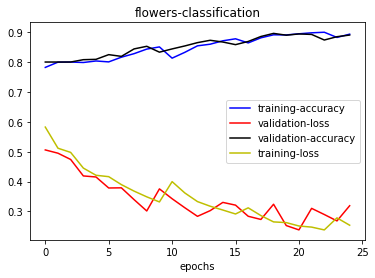

# Flower-classification
Classify 5 different flowers using CNN

# Tools used
1) kaggle to download the database (www.kaggle.com/alxmamaev/flowers-recognition)
2) Google-Colab to run the program on cloud GPU
3) Keras and Python to implement CNN

# Loss and Accuracy
**accuracy achieved is 89.3%**

